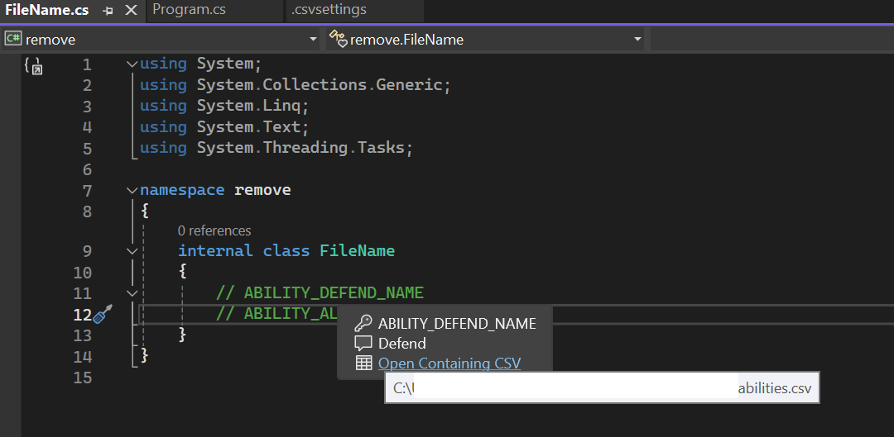

# CVS Translation Lookup
(i have no better name)

## Description
This is a Visual Studio Extension (VSIX) that enables the following
1. When a new solution is opened, it will scan the solution directory for any `.csv` files.
2. For each `.csv` file it finds, it will parse the file and perform the following for each row:
   1. The first column will be used as the `key`
   2. The second column will be used as the `value`
   3. A `LookupItem` will be generated based on the `key`, `value`, the line number, and the path to that file.
   4. Each `LookupItem` is placed within a dictionary for lookup.
3. When you have any file opened in the editor, when you hover over any word whether it is a syntax keyword, a comment word, whatever...any word, it will check if the word hovered over is in the lookup dictionary. If it finds it, a tool tip will be displayed that shows the following:
   1. The `key`
   2. The `value`
   3. A clickable link to open the CSV file in your configured editor that contains that key (see configuration for how to configure editor).



## Features
1. Changes made to the CSV files are hot reloaded and reflected within Visual Studio when hovering over a valid keyword
2. Adding new CSV files will automatically be picked up and loaded

## Configuration
After installing the extension, the first time a solution is opened, a default settings file `.csvsettings` will be created and placed in the same directory as the solution file.  You can edit this file, or provide your own before hand to adjust the the settings to how you would like.  The following is the default settings and an explanation of each:

```js
{
    //  The fully-qualified path to the directory to watch for CSV files.
    //  All CSV files in this directory will be mapped and watched as well as any new files added
    //  including subdirectories of this directory.
    //
    //  If this is an empty string, it will default to using the solution directory instead.
    "WatchPath": "",

    //  The executable to open the CSV file with.  By default, this will use notepad.exe
    //  This should be either the fully-qualified path to the executable .exe file to open the
    //  csv with, or you need to ensure that the .exe is in your $PATH environment variable.
    "OpenWith": "notepad.exe",

    //  Additional arguments that you would like to pass to the process when executing the
    //  command to open the CSV file.  The command that is build looks like the following
    //
    //      path/to/application.exe path-to-file.csv arguments
    //
    //  So your arguments would be prepended to the command.
    "Arguments": "",

    //  Fallback Suffixes allow you to specify additional suffixes to search for if a token word
    //  is not found.
    //
    //  For instance, if you add the fallback suffix _M and you have the token ABILITY_NAME_M  as the key in
    //  the CSV, but the text in the editor is ABILITY_NAME, since it will not find the ABILITY_NAME key,
    //  it will then do an additional search by appending all suffixes defined here, in order of the suffixes
    //  defined, until it either finds a match or exhausts all suffixes.
    "FallbackSuffix": [],

    //  The delimiter used in your CSV file. This is comma by default.
    "Delimiter": ","
}
```

## License
This is licensed under the MIT License. See [License](LICENSE) for full license text.
