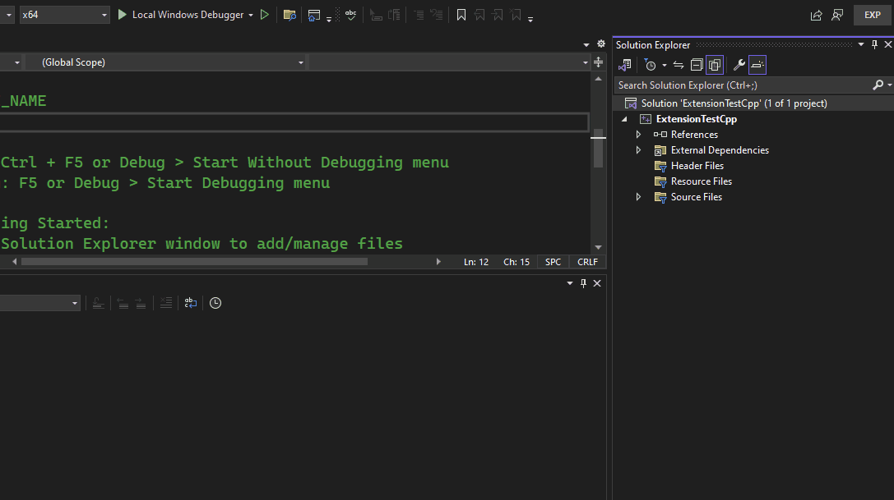

# CSV Translation Lookup
(i have no better name)

> ⚠ Warning
> This is a very specialized Visual Studio extension and probably not useful to many outside of the individuals it was created for.  With that said, at this time, the current version is 0.0.2, which is still an early version. There may be bugs or issue.  Please report any issues you find.

## Description
This is a Visual Studio Extension (VSIX) that enables the following
1. Scans a configured watch directory for any `.csv` files.
2. For each `.csv` file it finds, it will parse the file and perform the following for each row:
   1. The first column will be used as the `key`
   2. The second column will be used as the `value`
   3. A `CSVItem` will be generated based on the `key`, `value`, the line number, and the path to that file.
   4. Each `CSVItem` is placed within a dictionary for lookup.
3. When you have any file opened in the editor, when you hover over any word whether it is a syntax keyword, a comment word, whatever...any word, it will check if the word hovered over is in the lookup dictionary. If it finds it, a tool tip will be displayed that shows the following:
   1. The `key`
   2. The `value`
   3. A clickable link to open the CSV file in your configured editor that contains that key (see configuration for how to configure editor).


## Features
1. Changes made to the CSV files are hot reloaded and reflected within Visual Studio when hovering over a valid keyword
2. Adding new CSV files will automatically be picked up and loaded

## Installation
You can download the latest release of the VSIX from the Releases page in this repo or you can download the source code and build it yourself.

## Configuration
After installing the extension, the first time a solution is opened, you will need to manually create a new `csvconfig.json` file in the solution.  This specifically needs to be added at the solution level as a **Solution Item**. See gif below for demonstration:


Once you have created this file, you can copy and paste the following as the default contents and configurations

```json
{
    "watchPath": "",
    "openWith": "",
    "arguments": "",
    "fallBackSuffixes": [],
    "delimiter": ",",
    "quote": "\""
}
```

| Configuration | Type | Required? |  Description |
| --------------|------|-----------|--------------|
| watchPath        | `string`        | optional | A file path **relative to the `csvconfig.json` file to the directory that contains the CSV files to scan and use.  **If this property is not defined, or if it is an empty string, then the default value will be the directory of the `csvconfig.json` file itsef.** |
| openWith         | `string`        | optional | The absolute file path to the executable to use to open the CSV files with.  If the executable you are using is already accessible within your `$PATH` environment variable, then you can just supply the executable name. **If this property is not defined, or if it is an empty string, then the file will open in your default configured application to open CSVs with**. |
| arguments        | `string`        | optional | Any arguments to pass to the executable defined in the `openWith` property.  If you include `{linenumber}` in the argument string, then this will be replaced with the actual line number of the item in the CSV. **Arguments are only used if a value is given for the `openWith` property** |
| fallBackSuffixes | `Array[string]` | optional | An array of strings that will be used a fallbacks if the token keyword being hovered over is not found.   For instance, if you add the fallback suffix `_M` and you have the token `ABILITY_NAME_M` as the key in a CSV file, but in th text editor is the token keyword `ABILITY_NAME`, since it will not find the `ABILITY_NAME` key, it will then do an additional search by appending all suffixes defined here, in order of the suffixes, until it finds a match or exhausts all suffixes. |
| delimiter        | `string`        | optional | The single character delimiter used to delineate values in the CSV files being read.  **IF this property is not defined, or if it is an empty string, then the default value will be a comma `,`.** |
| quote            | `char`          | optional | THe character that represents the start and end of a quoted block within the CSV file. **If this property is not defined, or if it is an empty char, then the default value will be double quote `"`** | `"`

Once the file is saved for the first time, the extension will automatically begin parsing the CSV files based on the configurations.

> ⚠ Warning
> At this time, after creating the `csvconfig.json`, directly after creating it, the extension will not pick it up.  You will need to actually perform a file save even if nothing is add to the file.  This is because, as far as I'm aware, there are no events for VSIX to hook into when a new item is added to a solution, only when a document is opened or changed.  In a future update, I can adjust this to work with the opened event.

## License
This is licensed under the MIT License. See [License](LICENSE) for full license text.

